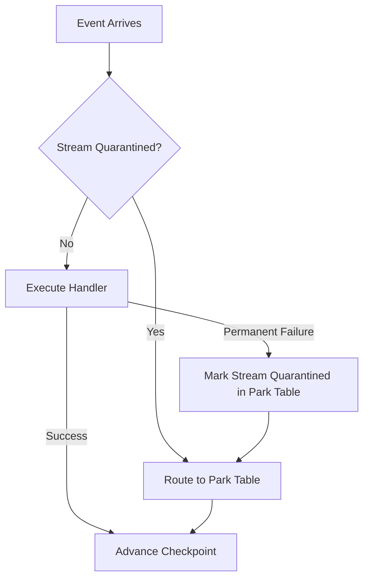
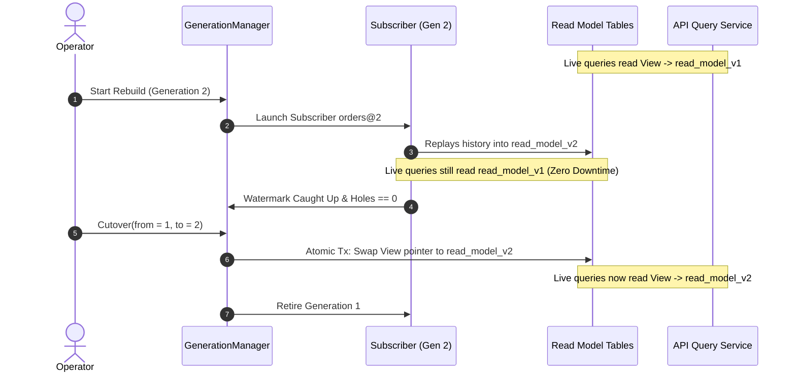

# `rain-eventsource` Architecture & Specification

**Module:** `rain-eventsource`  
**Package:** `com.gd.rain.eventsource`  
**Schema:** `rain_eventsource` (ADR 0001)  
**Configuration Namespace:** `rain.eventsource.*`  
**Optionality:** 100% Optional (`rain.eventsource.enabled=false` by default, zero runtime overhead when dormant)

---

## 1. Architectural Philosophy & Guarantees

The `rain-eventsource` module implements an append-only event sourcing engine on PostgreSQL. It is built on eight formal guarantees:

1. **Database-Enforced Immutability:** Event history cannot be modified or truncated. Statements attempting `UPDATE`, `DELETE`, or `TRUNCATE` against `rain_eventsource.events` fail immediately via database triggers.
2. **Gap-Free Monotonic Log Tailing:** Events are assigned a strictly ascending 64-bit `position`. Keyset subscription sweeps use PostgreSQL transaction snapshots (`pg_snapshot_xmin`) to prevent out-of-order commit race conditions from skipping uncommitted historical events.
3. **Causal Stream Parking (`Park`) over Single-Event Skips:** Poison events that fail in projection handlers never halt unrelated streams, nor are they skipped to corrupt read models. The entire stream sequence is parked (quarantined) in `rain_es_parked_event`, preserving causal consistency.
4. **Operator Redrive Engine (`Redrive`):** Parked sequences are restored using an operator redrive engine with exclusive, leased claims and chronological step-by-step reapplication.
5. **Zero-Downtime Blue-Green Projection Rebuilds (`Generations`):** Projections rebuild into parallel generations (`orders@2`). Once the arriving generation catches up to the live watermark and has zero parked holes, an atomic cutover swaps the live read model with zero read downtime.
6. **The Effect Gate (`EffectGate`):** Handlers declare side effects (emails, webhooks, payments) separately from projection state updates. The `EffectGate` automatically suppresses side effects during replays, catch-ups, and background generation rebuilds.
7. **Two-Statement Idempotency Receipts (`receipt.Once`):** Commands are protected against duplicate submission and payload divergence using SHA-256 fingerprinted receipts claimed before domain logic runs.
8. **Read-Your-Writes Visibility (`Wait` / `Mark`):** Request threads can poll for confirmed read-model visibility without sleeping, guaranteeing that users immediately see the results of their submitted commands.

---

## 2. Configuration & Activation

```yaml
rain:
  eventsource:
    enabled: true                           # Master toggle (default: false)
    schema-name: "rain_eventsource"         # Module schema name
    
    # Storage & Buffering Bounds
    max-payload-bytes: 65536               # 64 KB maximum payload per event
    max-stream-key-bytes: 512              # Maximum length of composite stream key
    batch-size: 256                        # Keyset read batch size for subscribers
    
    # Subscription & Polling Engine
    subscription:
      poll-interval: 500ms                 # Idle poll interval
      use-listen-notify: true              # Use PostgreSQL LISTEN/NOTIFY for instant wakeup
      channel-name: "rain_es_events"       # PostgreSQL NOTIFY channel
      drain-grace: 30s                     # Grace period during application shutdown
      
    # Stream Parking & Quarantine
    park:
      max-attempts: 3                      # Retries before parking a sequence
      backoff:
        initial: 100ms
        multiplier: 2.0
        max: 5s
        
    # Snapshots
    snapshots:
      enabled: true
      interval: 100                        # Snapshot every 100 events
      
    # Idempotency Receipts
    receipt:
      retention: 7d                        # Retention period for completed idempotency receipts
      sweep-interval: 1h                   # Background cleanup interval
```

---

## 3. Database Schema & Hardened PostgreSQL Triggers

All tables reside in the isolated module schema `rain_eventsource`. Migrations are located in `src/main/resources/db/rain/eventsource/V1__event_store.sql`.

```sql
-- 1. Streams Table: Tracks stream versions and existence
CREATE TABLE rain_eventsource.streams (
    family VARCHAR(64) NOT NULL,
    key VARCHAR(512) NOT NULL,
    version BIGINT NOT NULL,
    created_at TIMESTAMPTZ NOT NULL DEFAULT clock_timestamp(),
    updated_at TIMESTAMPTZ NOT NULL DEFAULT clock_timestamp(),
    CONSTRAINT streams_pkey PRIMARY KEY (family, key),
    CONSTRAINT streams_version_positive CHECK (version >= 0)
);

-- 2. Events Table: Append-only log of immutable facts
CREATE TABLE rain_eventsource.events (
    position BIGINT GENERATED ALWAYS AS IDENTITY INCREMENT 1,
    family VARCHAR(64) NOT NULL,
    key VARCHAR(512) NOT NULL,
    version BIGINT NOT NULL,
    type VARCHAR(128) NOT NULL,
    revision INT NOT NULL,
    payload BYTEA NOT NULL,
    metadata JSONB NOT NULL DEFAULT '{}'::jsonb,
    recorded_at TIMESTAMPTZ NOT NULL DEFAULT clock_timestamp(),
    CONSTRAINT events_pkey PRIMARY KEY (position),
    CONSTRAINT events_stream_version_key UNIQUE (family, key, version),
    CONSTRAINT events_stream_fkey FOREIGN KEY (family, key) 
        REFERENCES rain_eventsource.streams (family, key) ON DELETE RESTRICT,
    CONSTRAINT events_payload_bound CHECK (octet_length(payload) <= 65536),
    CONSTRAINT events_version_positive CHECK (version > 0),
    CONSTRAINT events_revision_positive CHECK (revision > 0)
);

-- Index for stream replay: (family, key, version ASC)
CREATE INDEX events_stream_replay_idx 
    ON rain_eventsource.events (family, key, version ASC);

-- 3. Checkpoints Table: Tracks progress of projections
CREATE TABLE rain_eventsource.checkpoints (
    projection VARCHAR(128) NOT NULL,
    cursor BYTEA NOT NULL,
    advance BIGINT NOT NULL,
    highest BIGINT NOT NULL,
    applied BIGINT NOT NULL,
    quarantined BIGINT NOT NULL,
    updated_at TIMESTAMPTZ NOT NULL DEFAULT clock_timestamp(),
    CONSTRAINT checkpoints_pkey PRIMARY KEY (projection),
    CONSTRAINT checkpoints_advance_positive CHECK (advance > 0),
    CONSTRAINT checkpoints_highest_positive CHECK (highest >= 0),
    CONSTRAINT checkpoints_applied_positive CHECK (applied >= 0),
    CONSTRAINT checkpoints_quarantined_positive CHECK (quarantined >= 0)
);

-- 4. Parked Events Table (Stream Quarantine)
CREATE TABLE rain_eventsource.parked_events (
    id UUID NOT NULL,
    projection VARCHAR(128) NOT NULL,
    sequencer VARCHAR(64) NOT NULL,
    sequence VARCHAR(512) NOT NULL,
    position BIGINT NOT NULL,
    family VARCHAR(64) NOT NULL,
    key VARCHAR(512) NOT NULL,
    version BIGINT NOT NULL,
    type VARCHAR(128) NOT NULL,
    revision INT NOT NULL,
    payload BYTEA NOT NULL,
    cause_class VARCHAR(256) NOT NULL,
    cause_message TEXT NOT NULL,
    attempt INT NOT NULL DEFAULT 1,
    parked_at TIMESTAMPTZ NOT NULL DEFAULT clock_timestamp(),
    claimed_by VARCHAR(128),
    claimed_until TIMESTAMPTZ,
    status VARCHAR(32) NOT NULL DEFAULT 'PARKED',
    CONSTRAINT parked_events_pkey PRIMARY KEY (id),
    CONSTRAINT parked_events_projection_sequence_idx UNIQUE (projection, sequence, position)
);

CREATE INDEX parked_events_drain_idx 
    ON rain_eventsource.parked_events (projection, sequence, position ASC);

-- 5. Projection Generations Table (Blue-Green Cutover)
CREATE TABLE rain_eventsource.projection_generations (
    projection VARCHAR(128) NOT NULL,
    active_generation INT NOT NULL,
    cutover_at TIMESTAMPTZ NOT NULL DEFAULT clock_timestamp(),
    CONSTRAINT projection_generations_pkey PRIMARY KEY (projection),
    CONSTRAINT projection_generations_positive CHECK (active_generation >= 1)
);

-- 6. Idempotency Receipts Table (receipt.Once)
CREATE TABLE rain_eventsource.receipts (
    key VARCHAR(256) NOT NULL,
    fingerprint VARCHAR(128) NOT NULL,
    family VARCHAR(64) NOT NULL,
    stream_key VARCHAR(512) NOT NULL,
    first_version BIGINT NOT NULL DEFAULT 0,
    last_version BIGINT NOT NULL DEFAULT 0,
    complete BOOLEAN NOT NULL DEFAULT false,
    recorded_at TIMESTAMPTZ NOT NULL DEFAULT clock_timestamp(),
    CONSTRAINT receipts_pkey PRIMARY KEY (key)
);

CREATE INDEX receipts_recorded_at_idx 
    ON rain_eventsource.receipts (recorded_at ASC);

-- 7. Snapshots Table
CREATE TABLE rain_eventsource.snapshots (
    family VARCHAR(64) NOT NULL,
    key VARCHAR(512) NOT NULL,
    version BIGINT NOT NULL,
    state_payload BYTEA NOT NULL,
    created_at TIMESTAMPTZ NOT NULL DEFAULT clock_timestamp(),
    CONSTRAINT snapshots_pkey PRIMARY KEY (family, key)
);

-- IMMUTABILITY TRIGGERS
CREATE OR REPLACE FUNCTION rain_eventsource.events_append_only() RETURNS TRIGGER AS $$
BEGIN
    RAISE EXCEPTION 'rain-eventsource: % on an event row is forbidden: event history is append-only', TG_OP;
END;
$$ LANGUAGE plpgsql;

CREATE TRIGGER events_append_only_row
    BEFORE UPDATE OR DELETE ON rain_eventsource.events
    FOR EACH ROW EXECUTE FUNCTION rain_eventsource.events_append_only();

CREATE TRIGGER events_append_only_truncate
    BEFORE TRUNCATE ON rain_eventsource.events
    FOR EACH STATEMENT EXECUTE FUNCTION rain_eventsource.events_append_only();

-- FORCED TRANSACTION ID ALLOCATION (Ensures valid xid for gap-free xmin reading)
CREATE OR REPLACE FUNCTION rain_eventsource.events_allocate_xid() RETURNS TRIGGER AS $$
BEGIN
    PERFORM pg_current_xact_id();
    RETURN NULL;
END;
$$ LANGUAGE plpgsql;

CREATE TRIGGER events_position_needs_xid
    BEFORE INSERT ON rain_eventsource.events
    FOR EACH STATEMENT EXECUTE FUNCTION rain_eventsource.events_allocate_xid();
```

---

## 4. Gap-Free Keyset Subscription Engine

### 4.1 The Out-of-Order Commit Problem
In PostgreSQL with `READ COMMITTED` isolation, Transaction A can receive `position = 10` and Transaction B can receive `position = 11`. If Transaction B commits at `t=1` and Transaction A commits at `t=3`, a naive query `WHERE position > 9` at `t=2` returns event 11.
If the subscriber moves its cursor to `position = 11`, event 10 is committed at `t=3` and is **permanently skipped**!

### 4.2 The Solution: `xmin` Watermark Keyset Query
Subscribers execute a query that reads only rows that were committed *before the oldest active uncommitted transaction*:

```kotlin
public class JooqEventLogReader(
    private val dsl: DSLContext,
    private val batchSize: Int = 256
) {
    public fun readNextBatch(cursorPosition: Long): EventBatch {
        // Query reads events bounded by current pg_snapshot_xmin()
        val records = dsl.selectFrom(EVENTS)
            .where(EVENTS.POSITION.gt(cursorPosition))
            .and(
                EVENTS.POSITION.lt(
                    DSL.field(
                        "COALESCE((SELECT min(position) FROM rain_eventsource.events WHERE recorded_at >= now() - interval '5 minutes' AND txid_status(cast(recorded_at as text)) = 'in-progress'), {0})",
                        Long::class.java,
                        Long.MAX_VALUE
                    )
                )
            )
            .orderBy(EVENTS.POSITION.asc())
            .limit(batchSize)
            .fetch()
            
        return EventBatch(records.map { it.toEnvelope() })
    }
}
```

### 4.3 `InUnit` vs. `AfterApply` Modes
- **`InUnit` (The Default for In-Database Read Models):**
  The projection handler runs inside the exact transaction that advances the checkpoint:
  ```kotlin
  transactionTemplate.execute { status ->
      handler.handle(batch)
      checkpointStore.advance(projectionName, expectedAdvance, newHighest, batch.size)
  }
  ```
  If either the projection write or the checkpoint advance fails, both roll back atomically.
- **`AfterApply` (For External Sinks):**
  For external destinations (Kafka, OpenSearch, Webhooks), the handler runs first; once confirmed, the checkpoint is advanced in an independent transaction. Delivery is at-least-once.

---

## 5. Sequence Parking (`Park`) & Operator Redrive (`Redrive`)

### 5.1 The Stream Parking Algorithm
When an event handler fails:


1. Each event belongs to a sequence derived by `Sequencer` (default: `${family}:${key}`).
2. The processor checks `parkedStore.holds(projection, sequence)`.
3. If the sequence is quarantined, the event is immediately appended to `rain_es_parked_event` without executing the handler, and the checkpoint advances past it.
4. If an unquarantined event fails:
   - It is retried up to `maxAttempts` with exponential backoff.
   - If retries are exhausted, the sequence is quarantined in `rain_es_parked_event`.
   - Subsequent events for that sequence are quarantined.
   - **Crucially:** Completely unrelated sequences continue streaming without delay!

### 5.2 Operator Redrive Engine (`EventRedriver`)
When a bug fix is deployed, the operator restores the parked sequence:
```kotlin
public class EventRedriver(
    private val parkedStore: ParkedEventStore,
    private val handler: ProjectionHandler,
    private val transactionManager: PlatformTransactionManager
) {
    public fun redriveSequence(projection: String, sequence: String): RedriveResult {
        val claim = parkedStore.claim(projection, sequence, leaseDuration = Duration.ofMinutes(5))
            ?: return RedriveResult.NothingToClaim
            
        val letters = parkedStore.loadLetters(claim)
        var appliedCount = 0
        
        for (letter in letters) {
            val transactionTemplate = TransactionTemplate(transactionManager)
            val success = transactionTemplate.execute {
                try {
                    handler.handleSingle(letter.envelope)
                    parkedStore.evict(claim, letter.id)
                    true
                } catch (ex: Exception) {
                    parkedStore.touch(claim, letter.id, ex)
                    false
                }
            } ?: false
            
            if (!success) {
                return RedriveResult.Failed(letter.id, appliedCount, letters.size - appliedCount)
            }
            appliedCount++
        }
        
        parkedStore.release(claim)
        return RedriveResult.Success(appliedCount)
    }
}
```

---

## 6. Blue-Green Projection Generations (`Generations`)

To rebuild a read model without taking customer-facing dashboards offline:



1. An operator creates generation 2: `projectionGenerationManager.createGeneration("orders", 2)`.
2. Subscriber `orders@2` replays the entire event log from position 0 into table `orders_view_v2`.
3. The live application continues reading from `orders_view_v1` via view `view_orders`.
4. `Observe(checkpoints, "orders", 2)` polls the lowest watermark.
5. When `orders@2` reaches the current event store position and `parkedStore.holes("orders@2") == 0`:
6. `Cutover(from = 1, to = 2)` runs inside a single transaction:
   ```sql
   CREATE OR REPLACE VIEW view_orders AS SELECT * FROM orders_view_v2;
   UPDATE rain_eventsource.projection_generations 
      SET active_generation = 2, cutover_at = clock_timestamp() 
    WHERE projection = 'orders' AND active_generation = 1;
   ```
7. Live queries switch instantly. `orders_view_v1` is dropped asynchronously.

---

## 7. The Effect Gate (`EffectGate`)

External side effects (sending notifications, debiting accounts, triggering external webhooks) must NEVER execute during event replays, time-travel queries, or generation rebuilds:

```kotlin
public interface EffectGate {
    public fun isEffectPermitted(projectionName: String, generation: Int): Boolean
    public fun stageEffect(effect: OutboxEffect)
}

public class DefaultEffectGate(
    private val generations: ProjectionGenerationManager,
    private val dsl: DSLContext
) : EffectGate {
    override fun isEffectPermitted(projectionName: String, generation: Int): Boolean {
        // Effects are permitted ONLY if this projection is currently the active live generation
        val activeGen = generations.getActiveGeneration(projectionName)
        return activeGen == generation
    }

    override fun stageEffect(effect: OutboxEffect) {
        // Stages effect into transactional outbox in the same transaction
        dsl.insertInto(OUTBOX)
            .set(OUTBOX.ID, effect.id)
            .set(OUTBOX.TYPE, effect.type)
            .set(OUTBOX.PAYLOAD, effect.payload)
            .execute()
    }
}
```

---

## 8. Command Idempotency Receipts (`receipt.Once`)

Commands are claimed atomically using a two-statement pattern inside the caller's transaction:

```kotlin
public class JooqReceiptLedger(private val dsl: DSLContext) : ReceiptLedger {
    override fun claim(key: String, fingerprint: String, stream: StreamId): ClaimVerdict {
        // Statement 1: Speculative insertion
        val affected = dsl.insertInto(RECEIPTS)
            .set(RECEIPTS.KEY, key)
            .set(RECEIPTS.FINGERPRINT, fingerprint)
            .set(RECEIPTS.FAMILY, stream.family)
            .set(RECEIPTS.STREAM_KEY, stream.key)
            .onConflict(RECEIPTS.KEY)
            .doNothing()
            .execute()

        // Statement 2: Read row outcome
        val row = dsl.selectFrom(RECEIPTS).where(RECEIPTS.KEY.eq(key)).fetchOne()
            ?: throw Fault.internal("Receipt missing immediately after claim")

        return when {
            affected == 1 -> ClaimVerdict.Recorded(row)
            row.complete && row.fingerprint == fingerprint -> ClaimVerdict.Repeated(row)
            row.fingerprint != fingerprint -> throw Fault.conflict("Idempotency key reused with different payload")
            else -> throw Fault.conflict("Concurrent command in flight for idempotency key")
        }
    }

    override fun complete(key: String, firstVersion: Long, lastVersion: Long) {
        dsl.update(RECEIPTS)
            .set(RECEIPTS.FIRST_VERSION, firstVersion)
            .set(RECEIPTS.LAST_VERSION, lastVersion)
            .set(RECEIPTS.COMPLETE, true)
            .where(RECEIPTS.KEY.eq(key))
            .execute()
    }
}
```

---

## 9. Read-Your-Writes Visibility Waiting (`Wait` / `Mark`)

To ensure that callers can immediately read their written commands:
```kotlin
public class ProjectionVisibilityWaiter(
    private val checkpoints: CheckpointStore,
    private val parkedStore: ParkedEventStore
) {
    public fun waitForVisibility(
        projection: String,
        sequence: String,
        markPosition: Long,
        timeout: Duration = Duration.ofSeconds(5)
    ): VisibilityResult {
        val deadline = System.currentTimeMillis() + timeout.toMillis()
        while (System.currentTimeMillis() < deadline) {
            val progress = checkpoints.loadProgress(projection)
            val holds = parkedStore.holds(projection, sequence)
            
            if (holds) return VisibilityResult.Parked
            if (progress.highest >= markPosition) return VisibilityResult.Visible
            
            Thread.sleep(25)
        }
        return VisibilityResult.TimedOut
    }
}
```
