# GDPR Article 17 Crypto-Shredding Specification

**Module:** `rain-eventsource-pii` (Optional Extension to `rain-eventsource`)  
**Package:** `com.gd.rain.eventsource.pii`  
**Schema:** `rain_eventsource_pii` (ADR 0001)  
**Configuration Namespace:** `rain.eventsource.pii.*`  
**Compliance Target:** EU GDPR Article 17 (Right to Erasure / Right to be Forgotten), CCPA, HIPAA

---

## 1. The Event Sourcing & GDPR Dilemma

In Event Sourcing, historical facts are immutable and append-only. In `rain-eventsource`, database triggers physically prevent `DELETE`, `UPDATE`, and `TRUNCATE` operations on `rain_eventsource.events`.
However, under EU GDPR Article 17, individuals have the legal right to request the total erasure of their personal data.

Directly executing `DELETE FROM events WHERE user_id = ...` would:
1. Break stream version continuity (`version = 1, 3, 4` missing version 2), causing aggregate loading and optimistic concurrency checks to fail.
2. Alter the stream payload fingerprint, invalidating historical idempotency receipts and audit trails.
3. Invalidate projection read-model watermarks and replay cursors.

### The Solution: Cryptographic Erasure (Crypto-Shredding)
Instead of modifying immutable database blocks, **Crypto-Shredding** ensures compliance mathematically:
1. Personally Identifiable Information (PII) is encrypted at the field level using Authenticated Encryption with Associated Data (AEAD, AES-256-GCM) with a unique, per-subject Data Encryption Key (DEK).
2. The encrypted ciphertext is stored in the append-only event payload.
3. Subject DEKs are stored in an isolated, mutable table (`rain_eventsource_pii.pii_subject_key`).
4. To "forget" a subject, the system **shreds** (permanently deletes or overwrites with cryptographically secure random bytes) that subject's DEK, deletes related aggregate snapshots, and scrubs read-model tables.
5. Once the key is destroyed, the ciphertext in historical events becomes mathematically impossible to decrypt, rendering the personal data permanently irretrievable while preserving 100% of event history, version numbers, and stream integrity.

---

## 2. Architecture & Data Flow

```mermaid
flowchart TD
    subgraph WritePath["Event Append Path"]
        Cmd[Command with PII] --> Enc[PiiAead: Encrypt with Subject DEK]
        Enc --> StoreEvt[Append Ciphertext to rain_eventsource.events]
    end

    subgraph KeyMgmt["Key Management"]
        KMS[Master Key / AWS KMS / Env] --> KEK[Key Encryption Key]
        KEK --> KeyStore[rain_eventsource_pii.pii_subject_key]
    end

    subgraph ErasurePath["GDPR Erasure Request"]
        Req[Erase Subject Request] --> Shred[Shred Subject DEK in KeyStore]
        Shred --> ScrubSnap[PiiSnapshotEraser: Scrub Aggregate Snapshots]
        ScrubSnap --> ScrubRM[PiiReadModelScrubber: Scrub Projection Views]
        ScrubRM --> AuditLog[Write to pii_erasure_log]
    end

    subgraph ReplayPath["Historical Event Replay"]
        ReadEvt[Read Historical Event] --> Dec{Subject DEK Exists?}
        Dec -->|Yes| Plain[Return Decrypted PII]
        Dec -->|No - Shredded| Erased[Return Anonymized Stub / Null]
    end
```



---

## 3. Database Schema (`rain_eventsource_pii`)

All tables reside in schema `rain_eventsource_pii`. Migrations are located in `src/main/resources/db/rain/eventsource/pii/V1__pii_keystore.sql`:

```sql
CREATE SCHEMA IF NOT EXISTS rain_eventsource_pii;

-- 1. Subject Encryption Keys Table
CREATE TABLE rain_eventsource_pii.pii_subject_key (
    subject_id VARCHAR(128) NOT NULL,
    key_version INT NOT NULL DEFAULT 1,
    algorithm VARCHAR(32) NOT NULL DEFAULT 'AES_256_GCM',
    encrypted_key BYTEA NOT NULL,
    key_iv BYTEA NOT NULL,
    status VARCHAR(32) NOT NULL DEFAULT 'ACTIVE', -- ACTIVE, SHREDDED, ROTATED
    created_at TIMESTAMPTZ NOT NULL DEFAULT clock_timestamp(),
    shredded_at TIMESTAMPTZ,
    CONSTRAINT pii_subject_key_pkey PRIMARY KEY (subject_id)
);

-- 2. PII Subject-Event Index Table (Tracks which streams hold data for a subject)
CREATE TABLE rain_eventsource_pii.pii_subject_event_index (
    subject_id VARCHAR(128) NOT NULL,
    family VARCHAR(64) NOT NULL,
    stream_key VARCHAR(512) NOT NULL,
    event_position BIGINT NOT NULL,
    recorded_at TIMESTAMPTZ NOT NULL DEFAULT clock_timestamp(),
    CONSTRAINT pii_subject_event_index_pkey PRIMARY KEY (subject_id, event_position)
);

CREATE INDEX pii_subject_stream_idx 
    ON rain_eventsource_pii.pii_subject_event_index (subject_id, family, stream_key);

-- 3. Compliance Erasure Audit Log (Permanent Proof of GDPR Article 17 Action)
CREATE TABLE rain_eventsource_pii.pii_erasure_log (
    id UUID NOT NULL,
    subject_id VARCHAR(128) NOT NULL,
    requested_by VARCHAR(128) NOT NULL,
    reason TEXT NOT NULL,
    snapshots_scrubbed INT NOT NULL DEFAULT 0,
    read_models_scrubbed INT NOT NULL DEFAULT 0,
    shredded_at TIMESTAMPTZ NOT NULL DEFAULT clock_timestamp(),
    verification_hash VARCHAR(128) NOT NULL,
    CONSTRAINT pii_erasure_log_pkey PRIMARY KEY (id)
);
```

---

## 4. Encryption & Jackson Serialization Engine

### 4.1 `EncryptedField<T>` Container
PII properties in domain events are declared using `EncryptedField<T>`:

```kotlin
public data class CustomerRegistered(
    val customerId: String,
    val email: EncryptedField<String>,
    val fullName: EncryptedField<String>,
    val dateOfBirth: EncryptedField<LocalDate>,
    val planTier: String // Non-PII field stored as plain JSON
) : DomainEvent
```

### 4.2 `PiiAead` AEAD Cryptographic Engine
Implements AES-256-GCM authenticated symmetric encryption with random 96-bit initialization vectors (IV) and 128-bit authentication tags:

```kotlin
public class PiiAead(private val keyStore: PiiKeyStore) {
    public fun <T> encrypt(
        subjectId: String,
        value: T,
        serializer: (T) -> ByteArray
    ): CiphertextEnvelope {
        val dek = keyStore.getOrCreateKey(subjectId)
        val plainBytes = serializer(value)
        val iv = ByteArray(12).also { SecureRandom().nextBytes(it) }
        
        val cipher = Cipher.getInstance("AES/GCM/NoPadding")
        val spec = GCMParameterSpec(128, iv)
        cipher.init(Cipher.ENCRYPT_MODE, SecretKeySpec(dek, "AES"), spec)
        cipher.updateAAD(subjectId.toByteArray(Charsets.UTF_8))
        
        val cipherBytes = cipher.doFinal(plainBytes)
        return CiphertextEnvelope(subjectId, iv, cipherBytes)
    }

    public fun <T> decryptOrNull(
        envelope: CiphertextEnvelope,
        deserializer: (ByteArray) -> T
    ): T? {
        val dek = keyStore.getKeyOrNull(envelope.subjectId)
        if (dek == null) {
            // Key has been shredded under GDPR Article 17!
            return null
        }
        
        val cipher = Cipher.getInstance("AES/GCM/NoPadding")
        val spec = GCMParameterSpec(128, envelope.iv)
        cipher.init(Cipher.DECRYPT_MODE, SecretKeySpec(dek, "AES"), spec)
        cipher.updateAAD(envelope.subjectId.toByteArray(Charsets.UTF_8))
        
        val plainBytes = cipher.doFinal(envelope.ciphertext)
        return deserializer(plainBytes)
    }
}
```

### 4.3 Jackson Custom Module Integration
A dedicated Jackson module (`PiiJacksonModule`) transparently serializes and deserializes `EncryptedField<T>` properties to and from JSON:
- When serializing an event to JSON for persistence in `rain_eventsource.events`, Jackson invokes `PiiAead.encrypt` and serializes:
  ```json
  {
    "customerId": "cust-123",
    "email": {
      "pii_subject": "cust-123",
      "iv": "v7q9s...==",
      "ciphertext": "8f3a9...=="
    },
    "planTier": "ENTERPRISE"
  }
  ```
- When deserializing during event replay or projection:
  - If the key exists: the field is decrypted back to `EncryptedField.Present("alice@example.com")`.
  - If the key was shredded: the field deserializes to `EncryptedField.Erased`.

---

## 5. Erasure Pipeline (`PiiErasureService`)

When a user exercises their GDPR Right to Erasure, `PiiErasureService` executes an atomic 4-step pipeline:

```kotlin
public class PiiErasureService(
    private val keyStore: PiiKeyStore,
    private val snapshotEraser: PiiSnapshotEraser,
    private val readModelScrubber: PiiReadModelScrubber,
    private val erasureLog: JooqErasureLog,
    private val transactionTemplate: TransactionTemplate
) {
    public fun eraseSubject(subjectId: String, requestedBy: String, reason: String): ErasureReport {
        return transactionTemplate.execute {
            // 1. Shred Data Encryption Key in KeyStore
            val keyShredded = keyStore.shredKey(subjectId)
            require(keyShredded) { "Subject $subjectId key not found or already shredded" }

            // 2. Scrub Aggregate Snapshots containing plain domain state
            val snapshotsScrubbed = snapshotEraser.scrubSnapshotsForSubject(subjectId)

            // 3. Scrub Read-Model Projection Views (mask or delete read-model rows)
            val readModelsScrubbed = readModelScrubber.scrubSubject(subjectId)

            // 4. Record Immutable Audit Verification
            val report = ErasureReport(
                id = UUID.randomUUID(),
                subjectId = subjectId,
                requestedBy = requestedBy,
                reason = reason,
                snapshotsScrubbed = snapshotsScrubbed,
                readModelsScrubbed = readModelsScrubbed,
                shreddedAt = Instant.now()
            )
            erasureLog.record(report)

            report
        }
    }
}
```

### 5.1 Aggregate Snapshot Scrubbing (`PiiSnapshotEraser`)
Because `rain-eventsource` periodically saves aggregate state snapshots in `rain_eventsource.snapshots` to accelerate `AggregateRepository.load()`, a snapshot might contain plaintext state cached before the erasure occurred.
- `PiiSnapshotEraser` uses `pii_subject_event_index` to find all aggregate streams touched by the erased subject and deletes their rows from `rain_eventsource.snapshots`.
- The next time the aggregate is loaded, the repository falls back to replaying events from version 0. During the replay, `EncryptedField` decodes as `Erased`, reconstructing the aggregate without the subject's personal data.

---

## 6. Verification & Conformance Testing

The `rain-eventsource-pii` test suite includes:
1. `CryptoShreddingRoundTripTest`: Asserts that an event with encrypted fields can be appended, replayed, and projected while the key is active.
2. `GdprErasureTest`: Appends 10 events, executes `eraseSubject()`, and verifies that:
   - The key in `pii_subject_key` is destroyed.
   - All subsequent replays yield `EncryptedField.Erased`.
   - The event row in `rain_eventsource.events` remains untouched with valid sequence/version numbers.
   - Concurrency tokens and version checks remain fully intact.
3. `SnapshotScrubberTest`: Confirms that cached snapshots are purged upon erasure.
4. `MasterKeyRotationTest`: Proves that master KEKs can be rotated without downtime or re-encrypting event logs.
