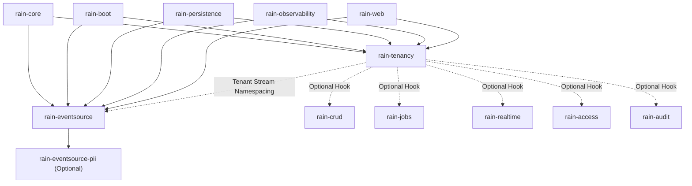

# Master Plan: Multi-Tenancy & Event Sourcing for the Rain Framework

**Status:** APPROVED ARCHITECTURAL BLUEPRINT & IMPLEMENTATION PLAN  
**Target Modules:** `rain-tenancy`, `rain-eventsource`, `rain-eventsource-pii`  
**Optionality:** 100% Optional (`rain.tenancy.enabled=false`, `rain.eventsource.enabled=false` by default, zero overhead when dormant)  
**Standards:** ADR 0001 (Schema per module), ADR 0002 (jOOQ over generated code, no Spring Data inside rain), ADR 0003 (Roles not profiles: `api`, `worker`), Explicit API mode, Zero compiler warnings, 4-space Spotless ktlint, Plan Criterion v3 (`QueryPlans.boundedScan`).

---

## 1. Executive Summary

This master plan establishes the production-grade architecture and implementation blueprint for integrating **Multi-Tenancy** and **Event Sourcing** into the `rain` framework (`/home/user/ws/frostgrove/kotlin/rain`).

The design synthesizes:
1. **The JVM & Spring Boot baseline in `./tmp/photon`**, retaining its developer experience (clean Kotlin annotations, aggregate lifecycle, type-safe command handlers) while ruthlessly eliminating its fatal architectural flaws (the PostgreSQL aborted-transaction deadlock in poison handling, head-of-line blocking, monolithic database-only tenancy, and unhedged side-effects).
2. **The formally proven concepts from `../../vv/framework` (Golang)**, incorporating its mathematical invariants:
   - Verified scope with operation-class admission (`ClassRead`, `ClassWrite`, `ClassDurable`) and origin fencing.
   - Row-level `Ownership` (`Column` vs. to-one `Through` correlated `EXISTS`) and preload relation declarations.
   - HMAC-sealed durable job tokens binding queue, definition, invocation ID, and payload digest.
   - Two-statement idempotency receipt claims (`INSERT ... ON CONFLICT DO NOTHING; SELECT ...`) with SHA-256 payload fingerprints (`Recorded`, `Repeated`, `Collided`, `Incomplete`).
   - Sequence and stream quarantine (`Park`) with causality preservation and operator `Redrive`.
   - Blue-Green projection rebuilds (`Generations`) with zero-downtime atomic cutovers.
   - The `EffectGate` preventing duplicate external side-effects during replays.
3. **GDPR Article 17 Crypto-Shredding** from Photon's `platform-pii`, enabling permanent subject erasure on immutable, append-only logs via AEAD subject-key shredding and snapshot scrubbing.

---

## 2. Architecture Comparison: Photon vs. vv/framework vs. Rain

| Capability / Invariant | `./tmp/photon` (Prototype) | `../../vv/framework` (Go) | `rain` (Target Architecture) |
|---|---|---|---|
| **Multi-Tenancy Isolation** | Database-per-tenant only (Hikari cache) | Shared-Row (`tenancyrow`) & Database (`tenancydb`) | **4 Pluggable Strategies**: `DISCRIMINATOR`, `SCHEMA`, `DATABASE`, `TIERED` |
| **Tenancy Scope Security** | Mutable `ThreadLocal<TenantId>`, forgeable | Verified `Scope`, unforgeable, origin-fenced | `TenantContext`: unforgeable `ScopedValue` (Loom) + CoroutineContext + ThreadLocal |
| **Lifecycle & Admission** | Enums `ACTIVE`, `SUSPENDED`, `DELETED` | Whitelist per operation class (`Read`, `Write`, `Durable`) | Whitelist per class; consistency checks (mutating requires readable) |
| **Durable Job Context** | Unprotected / lost in queue | HMAC-sealed token with payload digest | Sealed `TenantJobToken` via `rain-jobs` with secret rotation |
| **Row-Level Narrowing** | Missing | `Ownership`: `Column` & `Through` (correlated `EXISTS`) | `TenantQueryNarrower` (jOOQ) + `TenantScopeRule` (`rain-crud`) |
| **Preload Relation Isolation** | Missing (cross-tenant leak risk) | Required `Relation{Path, Field}` declaration | Declared relations in `ResourceSchema`; enforced by `CrudPlanProof` |
| **Event Immutability** | Application promise only | DB Triggers (`BEFORE UPDATE/DELETE/TRUNCATE`) | PostgreSQL DB Triggers in `V1__event_store.sql` (`rain_eventsource`) |
| **Transaction Allocation** | Standard Postgres insert | `BEFORE INSERT: PERFORM pg_current_xact_id()` | Database trigger ensuring xid allocation for gap-free `xmin` tracking |
| **Gap-Free Reads** | `(tx_id, id) > (last_tx, last_id)` + `xmin` | Monotonic `Position` + `xmin` safety watermark | Keyset pagination bounded by `pg_snapshot_xmin` |
| **Poison Event Handling** | Dead-letters single event; advances checkpoint | Parks entire sequence (`Park`); causal order | **Stream Parking (`Park`)**: sequence quarantined, unrelated streams proceed |
| **Poison Handler Tx Bug** | **CRITICAL BUG**: Fails on aborted PG connection | Autonomous transactional boundary / savepoints | Autonomous transaction / savepoint rollback before parking write |
| **Operator Recovery** | No redrive API | Operator `Redrive` (`Claim`, `Evict`, `Touch`) | Operator Redrive API + CLI command `es-redrive` |
| **Command Idempotency** | Key dedup only (ignores payload mismatch) | Two-statement claim + SHA-256 fingerprint | `receipt.Once` with SHA-256 fingerprint (`Recorded`, `Repeated`, `Collided`) |
| **Projection Replay** | In-place `TRUNCATE read_model` (downtime!) | Blue-Green `Generations` (`orders@2` + `Cutover`) | Blue-Green Generations with atomic view/table cutover (Zero downtime) |
| **Replay Side Effects** | Fired again during replay (email storms!) | `EffectGate` (`Spec.Effects` as value) | `EffectGate` silences `@SideEffect` handlers during replay/rebuild |
| **GDPR Crypto-Shredding** | Basic `platform-pii` AEAD module | Not present | Full `rain-eventsource-pii`: AEAD encryption, key shredding, snapshot scrubbing |
| **Scale Guarantees** | No plan assertions | Plan benchmarks | **Plan Criterion v3**: `QueryPlans.boundedScan` for all queries at 10M rows |

---

## 3. Module Dependency Graph & Layout

Rain adheres to strict modularization. New modules are declared in `settings.gradle.kts` and mapped in the root `build.gradle.kts` module graph:

### Module Specifications:
1. **`rain-tenancy`**:
   - Schema: `rain_tenancy` (holds control plane, tenant registry, credentials, leases, and audit bindings).
   - Package: `com.gd.rain.tenancy`.
   - Responsibilities: Tenant identification, context propagation (ScopedValue/Loom, Coroutines, ThreadLocal), multi-strategy routing (`DISCRIMINATOR`, `SCHEMA`, `DATABASE`, `TIERED`), Hikari pool cache, lifecycle admission, origin fencing, and HMAC job token sealing.
2. **`rain-eventsource`**:
   - Schema: `rain_eventsource` (holds `streams`, `events`, `checkpoints`, `parked_events`, `generations`, `receipts`, `snapshots`).
   - Package: `com.gd.rain.eventsource`.
   - Responsibilities: Append-only event store, gap-free subscriptions, AggregateRoot repository, CommandGateway, idempotency receipts, stream parking and redrive, blue-green projection generations, effect gating, and upcasting.
3. **`rain-eventsource-pii`**:
   - Schema: `rain_eventsource_pii` (holds `pii_subject_key`, `pii_erasure_log`).
   - Package: `com.gd.rain.eventsource.pii`.
   - Responsibilities: GDPR Article 17 crypto-shredding, AEAD encryption of sensitive event fields, per-subject key lifecycle, snapshot scrubbing, and erasure auditing.

---

## 4. Documentation Index

The complete architectural specification and engineering plan is divided into 10 exhaustive documents:

| Document | Title | Description |
|---|---|---|
| [`01-photon-deep-audit-and-gap-analysis.md`](./01-photon-deep-audit-and-gap-analysis.md) | Photon Deep Audit & Gap Analysis | Complete audit of all 12 modules in `tmp/photon`, cataloging 15 critical flaws and 20 missed use cases. |
| [`02-vv-framework-concepts-and-formal-invariants.md`](./02-vv-framework-concepts-and-formal-invariants.md) | Lessons & Invariants from `vv/framework` | In-depth analysis of Go implementation: mathematical invariants, contracts, and algorithms. |
| [`03-rain-tenancy-architecture-and-specs.md`](./03-rain-tenancy-architecture-and-specs.md) | `rain-tenancy` Architecture & Specs | Complete specification of the 4 isolation strategies, context engines, lifecycle admission, and module integrations. |
| [`04-rain-eventsource-architecture-and-specs.md`](./04-rain-eventsource-architecture-and-specs.md) | `rain-eventsource` Architecture & Specs | Complete specification of event storage, gap-free reads, Park & Redrive, Generations, Receipts, and EffectGate. |
| [`05-gdpr-pii-crypto-shredding.md`](./05-gdpr-pii-crypto-shredding.md) | GDPR Crypto-Shredding Engine | Cryptographic erasure for immutable append-only logs (AEAD encryption, subject keys, snapshot scrubbing). |
| [`06-query-plans-scale-proofs-and-schema.md`](./06-query-plans-scale-proofs-and-schema.md) | Query Plans, Scale Proofs & Schemas | Full Flyway DDL, PostgreSQL triggers, index definitions, and Criterion v3 `boundedScan` assertions at 10M rows. |
| [`07-photon-to-rain-porting-and-patch-guide.md`](./07-photon-to-rain-porting-and-patch-guide.md) | Photon to Rain Porting & Patch Guide | File-by-file porting inventory of all 72 source files in `tmp/photon`, with exact code transforms and bug fixes. |
| [`08-implementation-tasks-and-release-gate.md`](./08-implementation-tasks-and-release-gate.md) | Implementation Tasks & Release Gate | Granular engineering tasks across 8 implementation phases, verification commands, and release gate checks. |
| [`09-code-prototype-tenancy.md`](./09-code-prototype-tenancy.md) | Production Code Prototypes: `rain-tenancy` | Complete, compilable Kotlin code for all core classes in `rain-tenancy` (Explicit API, zero warnings). |
| [`10-code-prototype-eventsource.md`](./10-code-prototype-eventsource.md) | Production Code Prototypes: `rain-eventsource` | Complete, compilable Kotlin code for all core classes in `rain-eventsource` (Explicit API, zero warnings). |

---

## 5. Architectural Quality Guarantees

Every implementation task in this plan must satisfy the following non-negotiable repository gates:
1. **Plan-Proven Bounded Queries:** Every query against `rain_tenancy` or `rain_eventsource` extensible tables must be asserted with `QueryPlans.boundedScan` under plan criterion v3. No sequential scans, no unbounded scans, no `COUNT(*)` totals.
2. **Explicit API Mode:** Kotlin `-Xexplicit-api=strict` is active on all production modules. Every public class, method, property, and return type is explicitly declared.
3. **Zero Compiler Warnings:** `-Werror` is enforced. Deprecations or unchecked casts are fatal.
4. **Spotless ktlint Formatting:** 4-space indentation, strict import ordering, no wildcard imports.
5. **Kover Mandatory Coverage:** 100% of public APIs and at least 90% branch coverage asserted by `koverVerify`.
6. **SmartLifecycle & Runtime Roles:** Background loops (subscribers, pool eviction, lease renewal) are bound to `SmartLifecycle` and gated with `@ConditionalOnRainRole(RainRole.WORKER)`.
7. **Deterministic Time:** All temporal calculations inject `java.time.Clock`; direct calls to `Instant.now()` are forbidden.
